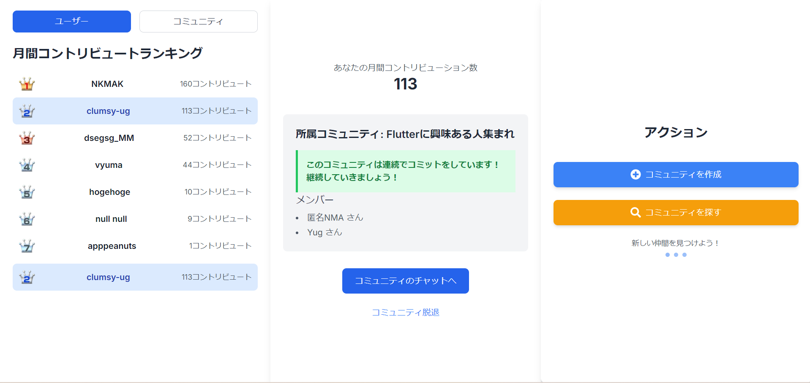
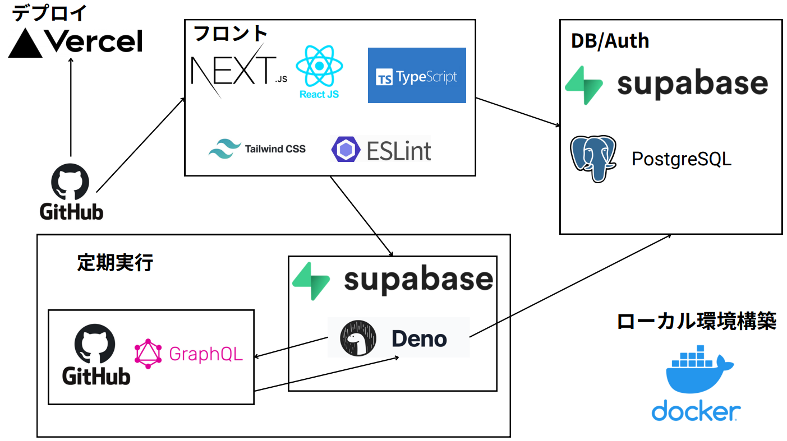

# GitHub-Battle
 [Play in browser](https://github-battle-community.vercel.app/)

# 内容
- GitHubアカウントを持っている開発者たちが集まって、期間を決めてコントリビューション数を競い合う
- 期間最終日まで毎日コントリビューションをし続けたメンバーのみ、お互いのXとGitHubアカウントのリンクが共有される
- 開発者のモチベーション向上だけでなく、初学者や孤独な開発者たちのコミュニティ形成の一助に

# 技術構成

# 開発者
- [NKMAK](https://github.com/NKMAK)
- [Yug](https://github.com/clumsy-ug)
- [vyuma](https://github.com/vyuma)
